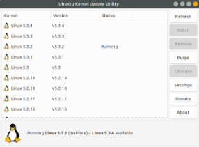

#!version: 1.0.0
#!title: Atualizando o Kernel do Linux

# #1 Adicionar Repositório
A forma mais fácil de atualizar o kernel do linux é com o software ukuu, para instalá-lo, basta adicionar o repositório:
<sudo>apt-add-repository ppa:teejee2008/ppa</sudo>
<sudo>apt update</sudo>

# #2 Instalar ukuu
<sudo>apt install ukuu</sudo>

# #3 Escolher Versão e Instalar

Após abrir o programa, basta clicar na versão que deseja instalar e apertar em "Install"